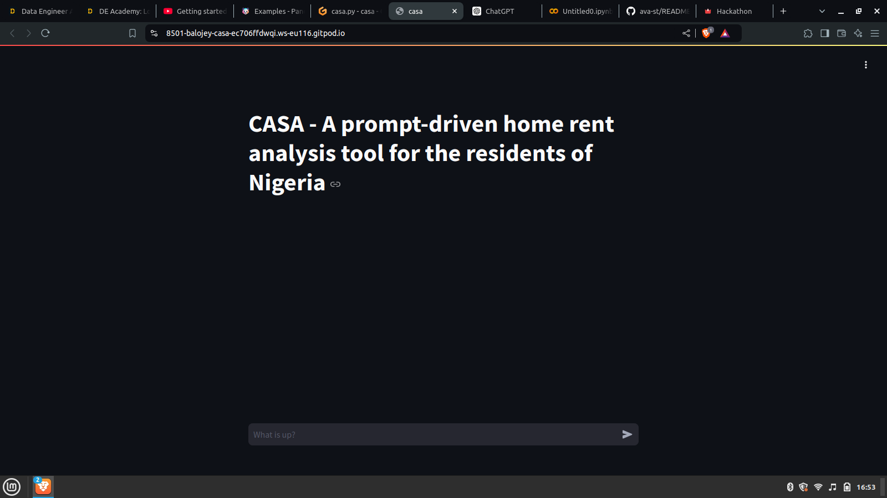
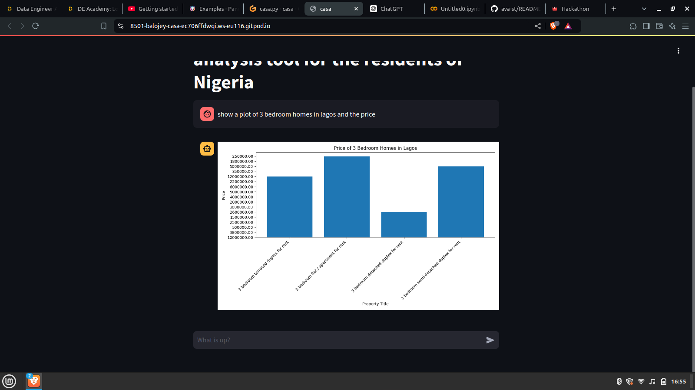
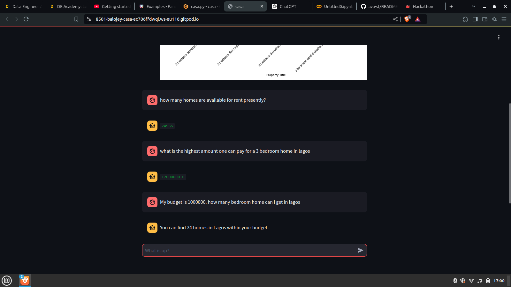
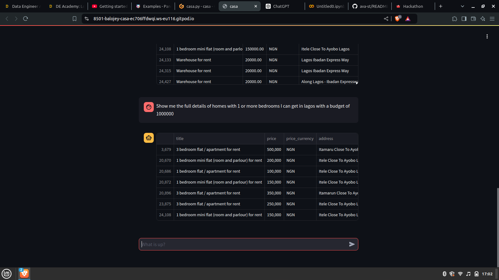

# CASA

[Live app](https://casa-ng.streamlit.app/)

**Casa: A Prompt-Based Home Rent Analysis Tool for Nigeria**

Casa is an innovative tool designed to assist residents of Nigeria in analyzing home rental prices. This prompt-based application enables families and individuals to compare rental prices across all 36 states and various areas within the country, helping them make informed decisions about where to live. By providing comprehensive insights into the rental market, Casa simplifies the process of evaluating residential options and promotes more effective decision-making for potential renters.

Casa is the italian word for "home".

## Demo





## Technologies

This application was brought to life using the following technologies

1. Gemini 1.5 Flash
2. PandasAI
3. Streamlit

## Setup

*Option 1*

Use Gitpod: go to [https://gitpod.io/#https://github.com/balojey/casa](https://gitpod/#https://github.com/balojey/casa)

All dependencies will be installed automatically

*Option 2*

Clone this repo:
```
git clone https://github.com/balojey/ava
```

Then, install dependencies:
```
pip install -r requirements.txt
```

## Run Ava

```
cp .streamlit/example.secrets.toml .streamlit/secrets.toml

# Get your google api key and fill it in your secrets.toml file

streamlit run casa.py
```